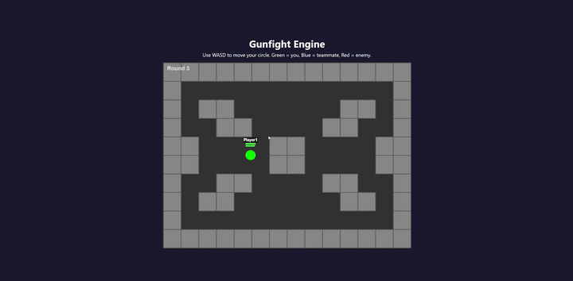
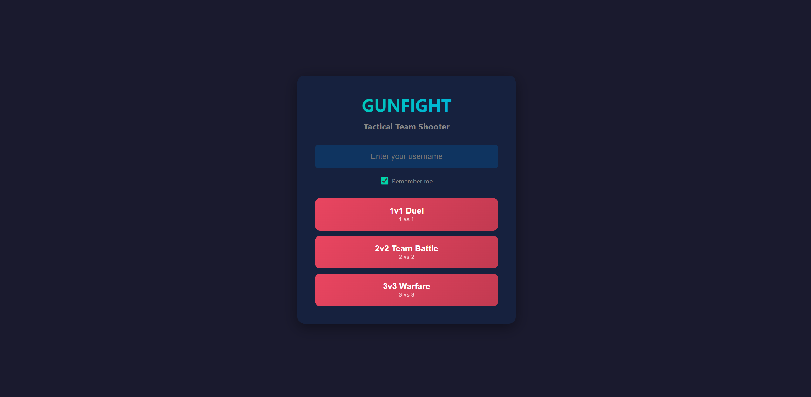
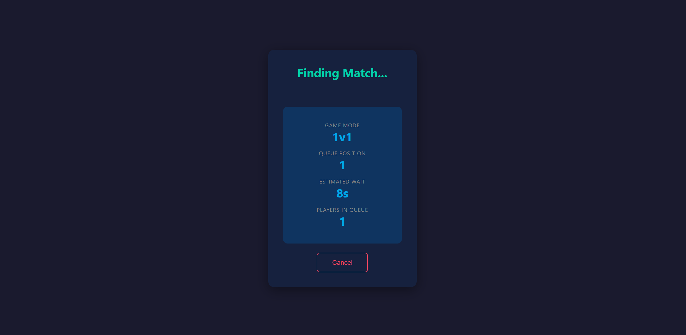
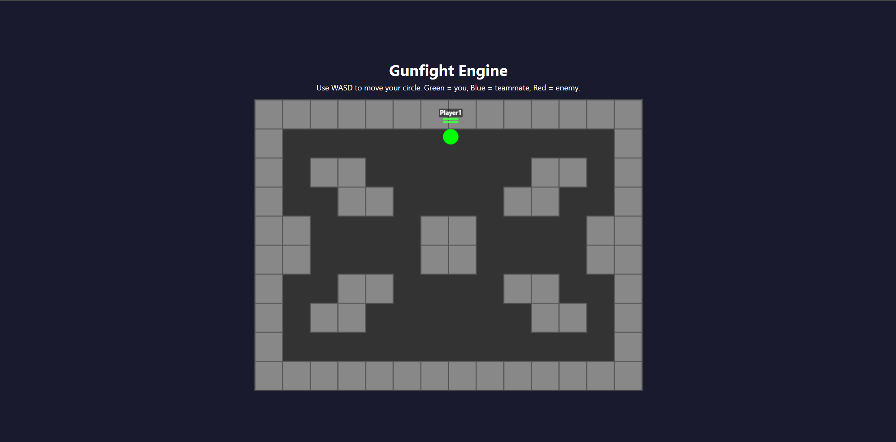
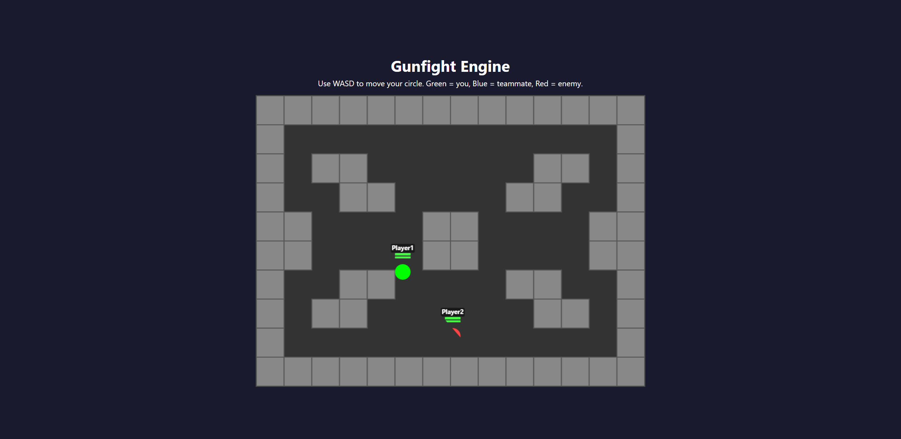
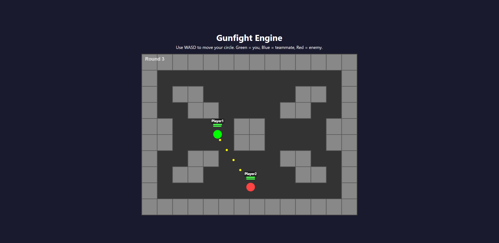

# Gunfight Engine

A real-time, round-based multiplayer tactical shooter built from scratch with a custom ECS (Entity Component System) game engine. It runs a Java game server with WebSocket networking and serves a cross-platform HTML5 client that works on desktop and mobile.

## Features

- **Custom ECS Engine** — data-oriented entity/component/system architecture with lock-free `EntityManager` and `ComponentRegistry`.
- **Real-Time Networking** — WebSocket-based server-authoritative simulation at 60 ticks per second.
- **Matchmaking & Lobbies** — 1v1, 2v2, and 3v3 queues with a scheduled matchmaker.
- **Cross-Platform Client** — HTML5/Canvas client with WASD controls for desktop and dual-touch virtual joysticks for mobile.
- **Responsive Mobile UI** — canvas scales correctly in portrait and landscape, including the mobile reload button.
- **Game Systems** — movement, wall collision, projectile physics, combat, death/respawn, round scoring, vision/line-of-sight, and weapon reloading.
- **Production-Ready Logging** — SLF4J + Logback with structured error handling and graceful shutdown.
- **Metrics & Benchmarks** — runtime tick/broadcast metrics and JMH benchmarks for hot-path systems.
- **Unit Tests** — JUnit 5 test suite covering the ECS core, game logic, and network packets.

## Resume Readiness Highlights

This project has been polished for portfolio use with the following production-quality additions:

- **26 JUnit 5 unit tests** covering ECS, game logic, and network packets.
- **Production logging** with SLF4J + Logback replacing every `System.out.println`.
- **Error resilience** with try/catch around the game loop so a single bad tick cannot crash the server.
- **Runtime metrics** (`GameMetrics` / `MetricsReporter`) logging tick and broadcast performance every 60 seconds.
- **Graceful shutdown** via a JVM shutdown hook that stops the WebSocket server, lobby, and game loops cleanly.
- **JMH benchmarks** measuring the hot-path `MovementSystem` at 4, 16, and 64 entities.
- **Comprehensive documentation** — architecture overview, WebSocket API, package design, and changelog.

## Quick Start

```bash
# Build the project and run tests
./gradlew build

# Start the server (serves web client on port 3000, WebSocket on port 8080)
./gradlew run
```

Then open `http://localhost:3000` in a browser, or connect from a mobile device on the same network.

## How to Play

**Desktop Controls:**
- **WASD** — Move your character
- **Mouse** — Aim
- **Left Click** — Fire weapon
- **R** — Reload weapon
- **Space** — Ready for rematch (when match is over)

**Mobile Controls:**
- **Left Joystick** — Move your character (touch left half of screen)
- **Right Joystick** — Aim (touch right half of screen)
- **Auto-Fire** — Automatically fires when an enemy is visible within your field of view
- **Reload Button** — Tap to reload weapon

**Game Rules:**
- Teams are 1v1, 2v2, or 3v3 depending on queue selection
- First team to win the majority of rounds wins the match
- You can only see enemies within your 90° field of view
- Walls block both movement and line of sight
- Coordinate with teammates to flank and control sightlines

## Screenshots

### Demo Video


### Main Menu


### Queue Screen


### Gameplay - Map Overview


### Gameplay - Fog of War


### Gameplay - Combat


## Known Limitations

- **Single Server Instance** — No horizontal scaling; runs on one JVM
- **No Persistence** — All match data is lost on server restart
- **Max 6 Players** — Limited to 3v3 matches due to map design
- **Single Map** — Only one static map layout is available
- **No Authentication** — Usernames are not verified or persistent
- **No Anti-Cheat** — Clients are trusted for input (server-authoritative but not validated)

## Future Improvements

- **Account System** — Persistent usernames, stats, and match history
- **Multiple Maps** — Rotating map pool with different layouts
- **Spectator Mode** — Allow players to watch ongoing matches
- **Replay System** — Record and replay matches for analysis
- **Voice Chat** — In-game voice communication for teammates
- **Server Clustering** — Support multiple server instances with load balancing
- **Ranked Mode** — Skill-based matchmaking with ELO ratings
- **Custom Games** — Allow players to create private lobbies with custom settings

## Project Structure

```
Gunfight-Engine/
├── app/
│   ├── src/main/java/com/gunfight/
│   │   ├── engine/          # Core ECS: EntityManager, ComponentRegistry, GameWorld, GameLoop, Room
│   │   ├── data/            # Plain component state containers
│   │   ├── logic/           # Server-side game systems (Movement, Combat, Vision, etc.)
│   │   ├── lobby/           # Matchmaking, queue, and room management
│   │   ├── net/             # WebSocket server, packets, and JSON state
│   │   ├── metrics/         # Runtime tick/broadcast metrics and reporter
│   │   └── Main.java        # Entry point
│   ├── src/test/java/       # JUnit 5 unit tests
│   ├── src/jmh/java/        # JMH benchmarks
│   └── build.gradle
├── web-client/              # HTML5/Canvas client
├── docs/                    # Architecture and API documentation
└── README.md
```

## Documentation

- [Architecture Overview](docs/ARCHITECTURE.md)
- [WebSocket API](docs/API.md)
- [Package Architecture](docs/doc-3-package-architecture.md)
- [Hybrid ECS Architecture](docs/hybrid-ecs-architecture.md)
- [Changelog](docs/CHANGELOG.md)

## Testing & Benchmarking

```bash
# Run unit tests
./gradlew test

# Run JMH benchmarks
./gradlew jmh
```

### What the tests cover

| File | Coverage |
|------|----------|
| `AppTest` | Main entry point greeting |
| `EntityManagerTest` | Entity ID allocation, reuse, and active state |
| `ComponentRegistryTest` | Add, retrieve, remove, and query components |
| `GameWorldTest` | Entity lifecycle and component-type filtering |
| `InputSystemTest` | Apply input packets to entity input components |
| `MovementSystemTest` | Movement during rounds, input handling, bounds clamping |
| `GameMetricsTest` | Tick/broadcast timing and reset behavior |
| `InputPacketTest` | JSON serialization, `entityId` is not sent to clients |
| `GameStatePacketTest` | Server-authoritative state packet serialization |

### Sample benchmark results

The `GameLoopBenchmark` measures the hot-path `MovementSystem` at 60 ticks per second.

```text
Benchmark                             (entityCount)  Mode  Cnt  Score   Error  Units
GameLoopBenchmark.movementSystemTick              4  avgt    3  0.622 ± 0.295  us/op
GameLoopBenchmark.movementSystemTick             16  avgt    3  2.029 ± 2.651  us/op
GameLoopBenchmark.movementSystemTick             64  avgt    3  6.971 ± 3.245  us/op
```

Each tick has about **16,667 microseconds** of budget. Even with **64 entities**, movement only uses about **7 microseconds**, leaving the rest of the budget for combat, projectiles, networking, and other systems.

Results are saved to `app/build/results/jmh/results.txt`.

## Architecture Overview

Gunfight Engine is a server-authoritative, real-time multiplayer shooter. The server simulates the game at 60 ticks per second and broadcasts the resulting state to connected clients.

```
HTML/Canvas Client  <--WebSocket/JSON-->  GameServer (Java 21)
                                                  |
          Lobby (OOP)  -->  Room  -->  GameLoop (ECS, 60 TPS)
                                                  |
        Input → Movement → Weapon → Projectile → Combat/Round/Vision → NetworkBroadcast
```

### Key Layers

- **OOP Lobby** — `LobbyManager`, `QueueManager`, `Matchmaker`, and `RoomManager` handle connections, usernames, matchmaking, and room lifecycle.
- **ECS Room** — Each `Room` owns a `GameWorld`, `GameLoop`, and a WebSocket-to-entity mapping.
- **GameLoop** — Processes input, then runs all logic systems, then broadcasts state via `NetworkBroadcastSystem`.
- **Hybrid StaticMap** — Walls are stored as a 14×10 boolean array instead of per-wall entities, giving O(1) tile lookups and no GC churn.

### Error Handling & Metrics

- The game loop is wrapped in `try/catch` so one bad tick cannot crash the room.
- A JVM shutdown hook stops the WebSocket server, lobby, and game loops cleanly.
- `GameMetrics` + `MetricsReporter` log average and max tick/broadcast times every 60 seconds.

### Full Details

- Architecture, WebSocket API, and changelog: see the `docs/` folder.

---

## Tech Stack

- **Java 21** — server and game engine
- **Gradle 9.4** — build system
- **Java-WebSocket** — WebSocket server
- **Gson** — JSON serialization
- **JUnit 5 + Mockito** — unit testing
- **SLF4J + Logback** — logging
- **JMH** — performance benchmarks
- **HTML5 Canvas + JavaScript** — client

## License

This project is for educational and portfolio purposes.
